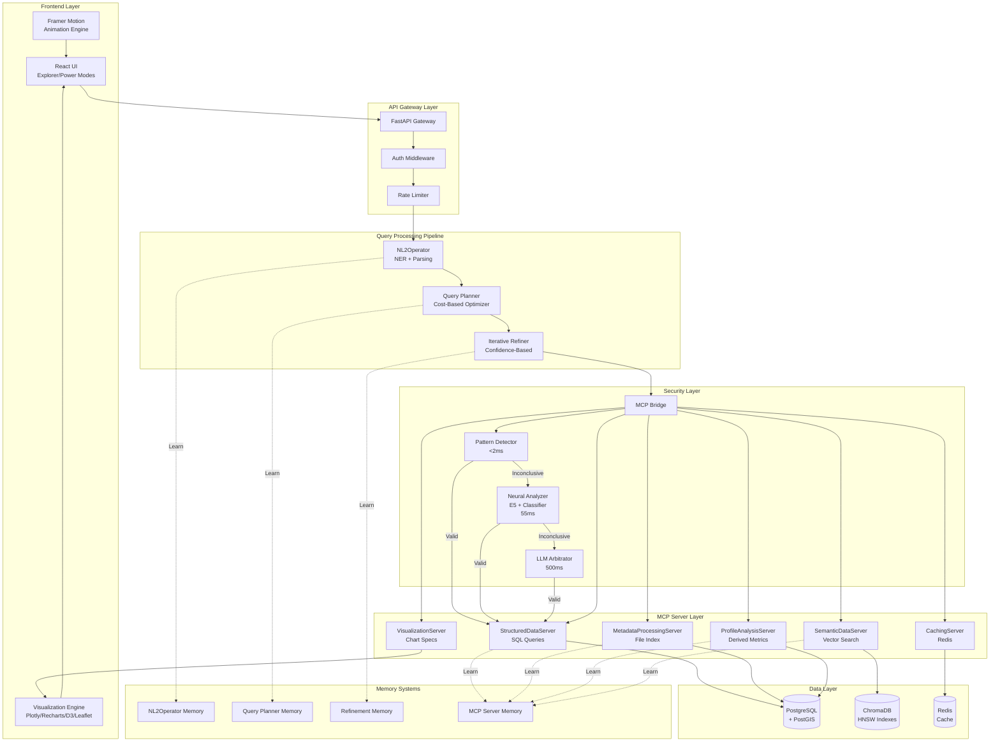

# Design Document: FloatChat

## Overview

FloatChat is a distributed AI-powered oceanographic data analytics platform that transforms natural language queries into optimized database operations, semantic searches, and interactive visualizations. The system architecture follows a microservices pattern with six specialized MCP servers orchestrated through a secure bridge, supported by four memory systems that enable continuous learning and optimization.

### Key Design Principles

1. **Separation of Concerns**: Each MCP server handles a specific domain (structured data, metadata, profiles, semantics, caching, visualization)
2. **Security-First**: Three-stage validation (pattern → neural → LLM) protects against malicious queries
3. **Performance-Optimized**: Multi-level caching, filter-aware indexing, and ML-based query planning
4. **User-Centric**: Dual-mode UI (Explorer/Power) with Gemini-inspired animations and conversational interface
5. **Continuous Learning**: Four memory systems capture and apply learned patterns across components
6. **Graceful Degradation**: Fallback strategies ensure functionality during partial failures

### Technology Stack

**Frontend**:
- React 18+ with TypeScript for type safety
- Zustand for state management (lightweight, performant)
- Framer Motion for animations
- Plotly.js (scientific charts), Recharts (dashboards), D3.js (custom visualizations)
- Leaflet with OpenStreetMap for mapping
- shadcn/ui for component library

**Backend**:
- FastAPI (Python) for high-performance async API
- Supabase (PostgreSQL + PostGIS + Realtime) for database
- ChromaDB with HNSW for vector search
- Redis for caching
- RabbitMQ for async task queuing

**AI/ML**:
- Gemini 2.0 Flash (default LLM)
- GPT-4o and Claude Sonnet 4.5 (alternative LLMs)
- E5-large-v2 for security embeddings
- spaCy for NER and dependency parsing

**Infrastructure**:
- Docker for containerization
- Kubernetes for orchestration
- Prometheus + Grafana for monitoring
- ELK Stack (Elasticsearch, Logstash, Kibana) for logging
- OpenTelemetry for distributed tracing


## Architecture

### System Architecture Diagram



### Component Responsibilities

**Frontend Layer**:
- Renders dual-mode UI (Explorer: simplified, Power: advanced with DAG visualization)
- Manages API key configuration and validation
- Handles chat interface with typing indicators and message bubbles
- Orchestrates animations (micro: <100ms, macro: <300ms, singleton: onboarding)
- Renders visualizations from server-provided specifications

**API Gateway Layer**:
- Exposes RESTful endpoints for query submission
- Validates authentication tokens
- Enforces rate limiting (100 req/min per user)
- Routes requests to query processing pipeline

**Query Processing Pipeline**:
- **NL2Operator**: Parses natural language into semantic operator DAG using spaCy NER, dependency parsing, and domain-specific entity extraction
- **Query Planner**: Generates optimized execution plans using ML-predicted costs, considers cache availability, respects deadline constraints
- **Iterative Refiner**: Monitors confidence scores, adjusts parameters, limits to 3 iterations, stops when improvement <0.1

**Security Layer**:
- **MCP Bridge**: Orchestrates three-stage validation
- **Pattern Detector**: Regex-based detection of SQL injection, path traversal (<2ms)
- **Neural Analyzer**: E5 embeddings + binary classifier trained on MCP-AttackBench (55ms, 96.01% accuracy)
- **LLM Arbitrator**: Gemini 2.0 Flash for complex edge cases (500ms)

**MCP Server Layer**:
- **StructuredDataServer**: Executes parameterized SQL queries, handles joins/aggregations
- **MetadataProcessingServer**: Queries file_index, extracts spatial/temporal bounds
- **ProfileAnalysisServer**: Computes mixed layer depth, gradients, anomalies, water mass properties
- **SemanticDataServer**: Performs vector similarity search with filter-aware HNSW indexes
- **CachingServer**: Manages Redis cache with normalized keys, TTL policies, LRU eviction
- **VisualizationServer**: Generates Plotly/Recharts/D3 specifications based on data type and query intent

**Data Layer**:
- **PostgreSQL + PostGIS**: Stores profiles, measurements, file index with spatial/temporal indexes
- **ChromaDB**: Stores profile embeddings with condition-aware HNSW graphs
- **Redis**: Caches query results with 5min TTL (real-time) or 24hr TTL (historical)

**Memory Systems**:
- **NL2Operator Memory**: Stores successful query interpretations (entity → column mappings, temporal resolutions)
- **Query Planner Memory**: Stores actual vs predicted execution costs for plan refinement
- **Refinement Memory**: Stores successful refinement strategies (parameter adjustments, iteration patterns)
- **MCP Server Memory**: Stores operation-specific optimizations (index hints, query rewrites)


## Components and Interfaces

### 1. NL2Operator Component

**Purpose**: Translate natural language queries into semantic operator DAGs

**Input**:
```typescript
interface NL2OperatorInput {
  query: string;              // Natural language query
  context?: QueryContext;     // Previous conversation context
  mode: 'explorer' | 'power'; // UI mode for complexity hints
}
```

**Output**:
```typescript
interface SemanticOperatorDAG {
  operators: Operator[];      // List of semantic operators
  edges: Edge[];              // Dependencies between operators
  confidence: number;         // Overall confidence score (0-1)
  alternatives?: SemanticOperatorDAG[]; // Alternative interpretations
}

interface Operator {
  id: string;
  type: 'filter' | 'aggregate' | 'join' | 'semantic_search' | 'compute' | 'visualize';
  params: Record<string, any>;
  estimatedCost: number;      // Milliseconds
}
```

**Processing Steps**:
1. **Tokenization**: Split query into tokens using spaCy
2. **NER**: Extract entities (locations, dates, parameters, floats)
3. **Dependency Parsing**: Identify relationships between entities
4. **Domain Mapping**: Map entities to database schema (e.g., "Arabian Sea" → bounding box)
5. **Operator Generation**: Create semantic operators from parsed structure
6. **Confidence Scoring**: Compute confidence based on entity recognition certainty
7. **Memory Lookup**: Check NL2Operator Memory for similar past queries
8. **Alternative Generation**: If confidence <0.7, generate multiple interpretations

**Example**:
```
Query: "Show me temperature profiles in the Arabian Sea from last month"

Operators:
1. Filter(region=BBox(50°E-77°E, 8°N-30°N), time=2024-01-01 to 2024-01-31)
2. Filter(parameter='temperature')
3. Aggregate(groupBy='profile_id')
4. Visualize(type='vertical_profile', overlay=true)

Confidence: 0.92
```

### 2. Query Planner Component

**Purpose**: Generate optimized execution plans from semantic operators

**Input**: `SemanticOperatorDAG`

**Output**:
```typescript
interface ExecutionPlan {
  steps: ExecutionStep[];
  estimatedCost: number;      // Total milliseconds
  cacheStrategy: CacheStrategy;
  parallelGroups: number[][];  // Groups of steps that can run in parallel
}

interface ExecutionStep {
  operator: Operator;
  mcpServer: string;          // Which MCP server handles this
  cacheKey?: string;          // Cache key if cacheable
  timeout: number;            // Step-specific timeout
}
```

**Planning Algorithm**:
1. **Cost Estimation**: Query Query Planner Memory for historical costs of similar operators
2. **Cache Check**: Identify operators with cached results
3. **Parallelization**: Build dependency graph, identify independent operators
4. **Server Assignment**: Map operators to appropriate MCP servers
5. **Deadline Awareness**: If deadline specified, prioritize fast plans over optimal plans
6. **Plan Selection**: Choose plan with lowest predicted cost meeting deadline

**Cost Model**:
```python
def estimate_cost(operator: Operator) -> float:
    base_cost = OPERATOR_BASE_COSTS[operator.type]
    
    # Adjust for data volume
    if 'row_estimate' in operator.params:
        base_cost *= log(operator.params['row_estimate'])
    
    # Adjust for cache availability
    if has_cache(operator):
        base_cost *= 0.05  # 95% reduction for cache hit
    
    # Adjust from historical data
    historical = query_planner_memory.get_similar(operator)
    if historical:
        base_cost = 0.7 * base_cost + 0.3 * historical.actual_cost
    
    return base_cost
```

### 3. MCP Bridge Component

**Purpose**: Validate and route requests to MCP servers with three-stage security

**Input**:
```typescript
interface MCPRequest {
  server: string;             // Target MCP server
  operation: string;          // Operation name
  params: Record<string, any>;
  userId: string;
  requestId: string;
}
```

**Output**:
```typescript
interface MCPResponse {
  success: boolean;
  data?: any;
  error?: {
    code: string;
    message: string;
    stage: 'pattern' | 'neural' | 'llm' | 'execution';
  };
  executionTime: number;
}
```

**Validation Pipeline**:

**Stage 1: Pattern Detection (<2ms)**
```python
MALICIOUS_PATTERNS = [
    r";\s*DROP\s+TABLE",           # SQL injection
    r"\.\./",                       # Path traversal
    r"<script>",                    # XSS
    r"UNION\s+SELECT",              # SQL injection
    r"exec\s*\(",                   # Code execution
]

def pattern_detect(request: MCPRequest) -> ValidationResult:
    for pattern in MALICIOUS_PATTERNS:
        if re.search(pattern, str(request.params), re.IGNORECASE):
            return ValidationResult(valid=False, confidence=1.0, stage='pattern')
    return ValidationResult(valid=None, confidence=0.0, stage='pattern')  # Inconclusive
```

**Stage 2: Neural Analysis (55ms)**
```python
def neural_analyze(request: MCPRequest) -> ValidationResult:
    # Generate E5 embedding
    embedding = e5_model.encode(serialize_request(request))
    
    # Binary classification
    threat_score = classifier.predict_proba(embedding)[1]
    
    if threat_score > 0.95:
        return ValidationResult(valid=False, confidence=threat_score, stage='neural')
    elif threat_score < 0.05:
        return ValidationResult(valid=True, confidence=1-threat_score, stage='neural')
    else:
        return ValidationResult(valid=None, confidence=0.0, stage='neural')  # Inconclusive
```

**Stage 3: LLM Arbitration (500ms)**
```python
def llm_arbitrate(request: MCPRequest) -> ValidationResult:
    prompt = f"""
    Analyze this MCP request for security threats:
    Server: {request.server}
    Operation: {request.operation}
    Params: {json.dumps(request.params)}
    
    Is this request malicious? Respond with JSON:
    {{"malicious": true/false, "reasoning": "...", "confidence": 0.0-1.0}}
    """
    
    response = gemini.generate(prompt)
    result = json.loads(response)
    
    return ValidationResult(
        valid=not result['malicious'],
        confidence=result['confidence'],
        stage='llm'
    )
```

### 4. StructuredDataServer (MCP Server)

**Purpose**: Execute SQL queries against PostgreSQL database

**Operations**:

**query_profiles**:
```typescript
interface QueryProfilesParams {
  filters: {
    bbox?: [number, number, number, number];  // [minLon, minLat, maxLon, maxLat]
    timeRange?: [string, string];             // ISO 8601 timestamps
    floatIds?: string[];
    dataMode?: ('R' | 'A' | 'D')[];
    qcFlags?: number[];
  };
  limit?: number;
  offset?: number;
}

interface QueryProfilesResponse {
  profiles: Profile[];
  totalCount: number;
  executionTime: number;
}
```

**query_measurements**:
```typescript
interface QueryMeasurementsParams {
  profileIds: string[];
  parameters?: ('temperature' | 'salinity' | 'pressure')[];
  depthRange?: [number, number];
  qcThreshold?: number;  // Minimum QC flag to include
}

interface QueryMeasurementsResponse {
  measurements: Measurement[];
  executionTime: number;
}
```

**Implementation**:
```python
class StructuredDataServer:
    def query_profiles(self, params: QueryProfilesParams) -> QueryProfilesResponse:
        query = """
            SELECT profile_id, float_id, cycle_number, timestamp,
                   ST_X(geom) as lon, ST_Y(geom) as lat,
                   data_mode, direction
            FROM profiles
            WHERE 1=1
        """
        
        conditions = []
        query_params = []
        
        if params.filters.bbox:
            conditions.append("""
                ST_Contains(
                    ST_MakeEnvelope(%s, %s, %s, %s, 4326),
                    geom
                )
            """)
            query_params.extend(params.filters.bbox)
        
        if params.filters.timeRange:
            conditions.append("timestamp BETWEEN %s AND %s")
            query_params.extend(params.filters.timeRange)
        
        if params.filters.floatIds:
            conditions.append(f"float_id = ANY(%s)")
            query_params.append(params.filters.floatIds)
        
        if conditions:
            query += " AND " + " AND ".join(conditions)
        
        query += f" LIMIT {params.limit or 1000} OFFSET {params.offset or 0}"
        
        start = time.time()
        results = self.db.execute(query, query_params)
        execution_time = (time.time() - start) * 1000
        
        # Store in MCP Server Memory
        self.memory.store_execution(
            operation='query_profiles',
            params=params,
            execution_time=execution_time,
            row_count=len(results)
        )
        
        return QueryProfilesResponse(
            profiles=results,
            totalCount=self.db.execute("SELECT COUNT(*) ..."),
            executionTime=execution_time
        )
```


### 5. SemanticDataServer (MCP Server)

**Purpose**: Perform vector similarity search with filter-aware indexing

**Operations**:

**semantic_search**:
```typescript
interface SemanticSearchParams {
  query: string;              // Natural language query
  filters?: {
    timeRange?: [string, string];
    bbox?: [number, number, number, number];
    qcFlags?: number[];
  };
  topK?: number;
  threshold?: number;         // Minimum similarity score
}

interface SemanticSearchResponse {
  results: SemanticResult[];
  executionTime: number;
}

interface SemanticResult {
  profileId: string;
  similarity: number;
  metadata: Record<string, any>;
}
```

**Filter-Aware HNSW Implementation**:
```python
class SemanticDataServer:
    def __init__(self):
        # Maintain multiple HNSW indexes for common filter combinations
        self.indexes = {
            'global': HNSWIndex(dim=1024, M=16, ef_construction=200),
            'recent_6mo': HNSWIndex(dim=1024, M=16, ef_construction=200),
            'high_qc': HNSWIndex(dim=1024, M=16, ef_construction=200),
            'arabian_sea': HNSWIndex(dim=1024, M=16, ef_construction=200),
            # ... more region-specific indexes
        }
    
    def semantic_search(self, params: SemanticSearchParams) -> SemanticSearchResponse:
        # Generate query embedding
        query_embedding = self.e5_model.encode(params.query)
        
        # Select appropriate index based on filters
        index_key = self._select_index(params.filters)
        index = self.indexes.get(index_key, self.indexes['global'])
        
        start = time.time()
        
        if index_key == 'global' and params.filters:
            # No specialized index, use post-filtering
            candidates = index.search(query_embedding, k=params.topK * 10)
            results = self._post_filter(candidates, params.filters)[:params.topK]
        else:
            # Use specialized index (no post-filtering needed)
            results = index.search(query_embedding, k=params.topK)
        
        execution_time = (time.time() - start) * 1000
        
        # Store in memory
        self.memory.store_execution(
            operation='semantic_search',
            params=params,
            execution_time=execution_time,
            index_used=index_key
        )
        
        return SemanticSearchResponse(
            results=results,
            executionTime=execution_time
        )
    
    def _select_index(self, filters: dict) -> str:
        """Select best index based on filters"""
        if not filters:
            return 'global'
        
        # Check for recent time range
        if filters.get('timeRange'):
            start, end = filters['timeRange']
            if (datetime.fromisoformat(end) - datetime.fromisoformat(start)).days < 180:
                return 'recent_6mo'
        
        # Check for high QC requirement
        if filters.get('qcFlags') == [1]:
            return 'high_qc'
        
        # Check for specific regions
        if filters.get('bbox'):
            region = self._identify_region(filters['bbox'])
            if region in self.indexes:
                return region
        
        return 'global'
```

### 6. ProfileAnalysisServer (MCP Server)

**Purpose**: Compute derived oceanographic metrics

**Operations**:

**compute_mixed_layer_depth**:
```typescript
interface ComputeMLDParams {
  profileIds: string[];
  criterion: 'temperature' | 'density';
  threshold: number;          // e.g., 0.2°C or 0.03 kg/m³
}

interface ComputeMLDResponse {
  results: {
    profileId: string;
    mld: number;              // meters
    confidence: number;
  }[];
  executionTime: number;
}
```

**compute_gradients**:
```typescript
interface ComputeGradientsParams {
  profileIds: string[];
  parameter: 'temperature' | 'salinity';
  method: 'finite_difference' | 'spline';
}

interface ComputeGradientsResponse {
  results: {
    profileId: string;
    gradients: {
      depth: number;
      gradient: number;       // units per meter
    }[];
  }[];
  executionTime: number;
}
```

**Implementation**:
```python
class ProfileAnalysisServer:
    def compute_mixed_layer_depth(self, params: ComputeMLDParams) -> ComputeMLDResponse:
        results = []
        
        for profile_id in params.profileIds:
            # Fetch measurements
            measurements = self.db.query("""
                SELECT depth, temperature, salinity, pressure
                FROM profile_measurements
                WHERE profile_id = %s AND qc_temp = 1
                ORDER BY depth
            """, [profile_id])
            
            if len(measurements) < 3:
                continue
            
            # Compute MLD based on criterion
            if params.criterion == 'temperature':
                mld = self._mld_temperature(measurements, params.threshold)
            else:
                mld = self._mld_density(measurements, params.threshold)
            
            results.append({
                'profileId': profile_id,
                'mld': mld,
                'confidence': self._compute_confidence(measurements)
            })
        
        return ComputeMLDResponse(results=results, executionTime=...)
    
    def _mld_temperature(self, measurements: List[Measurement], threshold: float) -> float:
        """Find depth where temperature differs from surface by threshold"""
        surface_temp = measurements[0].temperature
        
        for m in measurements[1:]:
            if abs(m.temperature - surface_temp) > threshold:
                return m.depth
        
        return measurements[-1].depth  # MLD deeper than profile
    
    def _mld_density(self, measurements: List[Measurement], threshold: float) -> float:
        """Find depth where density differs from surface by threshold"""
        # Compute potential density using seawater library
        surface_density = gsw.rho(
            measurements[0].salinity,
            measurements[0].temperature,
            measurements[0].pressure
        )
        
        for m in measurements[1:]:
            density = gsw.rho(m.salinity, m.temperature, m.pressure)
            if abs(density - surface_density) > threshold:
                return m.depth
        
        return measurements[-1].depth
```

### 7. VisualizationServer (MCP Server)

**Purpose**: Generate visualization specifications for frontend rendering

**Operations**:

**generate_visualization**:
```typescript
interface GenerateVisualizationParams {
  data: any[];                // Data to visualize
  vizType: 'trajectory' | 'hovmoller' | 'profile' | 'heatmap' | 'timeseries' | 'ts_diagram' | 'qc_dashboard';
  options?: {
    title?: string;
    xLabel?: string;
    yLabel?: string;
    colorScale?: string;
    annotations?: Annotation[];
  };
}

interface GenerateVisualizationResponse {
  spec: PlotlySpec | RechartsSpec | D3Spec | LeafletSpec;
  library: 'plotly' | 'recharts' | 'd3' | 'leaflet';
  executionTime: number;
}
```

**Implementation**:
```python
class VisualizationServer:
    def generate_visualization(self, params: GenerateVisualizationParams) -> GenerateVisualizationResponse:
        if params.vizType == 'trajectory':
            return self._generate_trajectory_map(params)
        elif params.vizType == 'hovmoller':
            return self._generate_hovmoller(params)
        elif params.vizType == 'profile':
            return self._generate_profile_comparison(params)
        elif params.vizType == 'ts_diagram':
            return self._generate_ts_diagram(params)
        # ... other types
    
    def _generate_trajectory_map(self, params) -> GenerateVisualizationResponse:
        """Generate Leaflet map specification with float trajectories"""
        spec = {
            'center': self._compute_center(params.data),
            'zoom': self._compute_zoom(params.data),
            'layers': [
                {
                    'type': 'tileLayer',
                    'url': 'https://{s}.tile.openstreetmap.org/{z}/{x}/{y}.png',
                    'attribution': '© OpenStreetMap contributors'
                }
            ],
            'trajectories': []
        }
        
        # Group data by float_id
        by_float = defaultdict(list)
        for point in params.data:
            by_float[point['float_id']].append(point)
        
        # Create trajectory for each float
        for float_id, points in by_float.items():
            sorted_points = sorted(points, key=lambda p: p['timestamp'])
            spec['trajectories'].append({
                'floatId': float_id,
                'coordinates': [[p['lat'], p['lon']] for p in sorted_points],
                'timestamps': [p['timestamp'] for p in sorted_points],
                'color': self._assign_color(float_id),
                'popup': f"Float {float_id}"
            })
        
        return GenerateVisualizationResponse(
            spec=spec,
            library='leaflet',
            executionTime=...
        )
    
    def _generate_hovmoller(self, params) -> GenerateVisualizationResponse:
        """Generate Plotly Hovmöller diagram (depth-time contour)"""
        # Pivot data to create 2D grid
        times = sorted(set(p['timestamp'] for p in params.data))
        depths = sorted(set(p['depth'] for p in params.data))
        
        # Create grid
        grid = np.full((len(depths), len(times)), np.nan)
        for p in params.data:
            i = depths.index(p['depth'])
            j = times.index(p['timestamp'])
            grid[i, j] = p['temperature']
        
        spec = {
            'data': [{
                'type': 'contour',
                'x': times,
                'y': depths,
                'z': grid.tolist(),
                'colorscale': 'Viridis',
                'contours': {
                    'coloring': 'heatmap'
                },
                'colorbar': {
                    'title': 'Temperature (°C)'
                }
            }],
            'layout': {
                'title': params.options.get('title', 'Temperature Evolution'),
                'xaxis': {'title': 'Time'},
                'yaxis': {'title': 'Depth (m)', 'autorange': 'reversed'},
                'hovermode': 'closest'
            }
        }
        
        return GenerateVisualizationResponse(
            spec=spec,
            library='plotly',
            executionTime=...
        )
```


### 8. CachingServer (MCP Server)

**Purpose**: Manage Redis-based result caching with intelligent TTL and eviction

**Operations**:

**get_cached**:
```typescript
interface GetCachedParams {
  key: string;
}

interface GetCachedResponse {
  hit: boolean;
  data?: any;
  ttl?: number;               // Remaining TTL in seconds
}
```

**set_cached**:
```typescript
interface SetCachedParams {
  key: string;
  data: any;
  ttl?: number;               // Seconds, defaults based on data type
  tags?: string[];            // For invalidation
}
```

**Implementation**:
```python
class CachingServer:
    def __init__(self):
        self.redis = redis.Redis(host='redis', port=6379, db=0)
        self.default_ttls = {
            'real_time': 300,      # 5 minutes
            'historical': 86400,   # 24 hours
            'metadata': 3600,      # 1 hour
            'visualization': 1800  # 30 minutes
        }
    
    def get_cached(self, params: GetCachedParams) -> GetCachedResponse:
        data = self.redis.get(params.key)
        
        if data:
            ttl = self.redis.ttl(params.key)
            return GetCachedResponse(
                hit=True,
                data=json.loads(data),
                ttl=ttl
            )
        
        return GetCachedResponse(hit=False)
    
    def set_cached(self, params: SetCachedParams) -> None:
        # Determine TTL
        ttl = params.ttl or self._infer_ttl(params.data)
        
        # Store data
        self.redis.setex(
            params.key,
            ttl,
            json.dumps(params.data)
        )
        
        # Store tags for invalidation
        if params.tags:
            for tag in params.tags:
                self.redis.sadd(f"tag:{tag}", params.key)
    
    def invalidate_by_tag(self, tag: string) -> int:
        """Invalidate all cache entries with given tag"""
        keys = self.redis.smembers(f"tag:{tag}")
        if keys:
            self.redis.delete(*keys)
            self.redis.delete(f"tag:{tag}")
        return len(keys)
    
    def _infer_ttl(self, data: any) -> int:
        """Infer appropriate TTL based on data characteristics"""
        # Check if data contains recent timestamps
        if 'timestamp' in data:
            age = datetime.now() - datetime.fromisoformat(data['timestamp'])
            if age.days < 7:
                return self.default_ttls['real_time']
        
        return self.default_ttls['historical']
    
    def _generate_cache_key(self, operation: str, params: dict) -> str:
        """Generate normalized cache key from operation and params"""
        # Sort params for consistency
        sorted_params = json.dumps(params, sort_keys=True)
        
        # Hash to fixed length
        hash_value = hashlib.sha256(sorted_params.encode()).hexdigest()[:16]
        
        return f"{operation}:{hash_value}"
```

### 9. Iterative Refinement Component

**Purpose**: Automatically refine queries when initial results are insufficient

**Algorithm**:
```python
class IterativeRefiner:
    def __init__(self):
        self.max_iterations = 3
        self.min_improvement = 0.1
        self.refinement_memory = RefinementMemory()
    
    def refine(self, query: str, initial_results: QueryResults) -> QueryResults:
        current_results = initial_results
        iteration = 0
        
        while iteration < self.max_iterations:
            # Evaluate result quality
            confidence = self._evaluate_confidence(current_results)
            
            if confidence >= 0.8:
                break  # Results are good enough
            
            # Check if we have learned refinement strategy
            learned_strategy = self.refinement_memory.get_strategy(query, current_results)
            
            if learned_strategy:
                adjustments = learned_strategy
            else:
                adjustments = self._generate_adjustments(query, current_results)
            
            # Apply adjustments
            refined_query = self._apply_adjustments(query, adjustments)
            new_results = self._execute_query(refined_query)
            
            new_confidence = self._evaluate_confidence(new_results)
            
            # Check improvement
            if new_confidence - confidence < self.min_improvement:
                break  # Not improving enough
            
            # Store successful refinement
            if new_confidence > confidence:
                self.refinement_memory.store_strategy(
                    original_query=query,
                    adjustments=adjustments,
                    improvement=new_confidence - confidence
                )
            
            current_results = new_results
            iteration += 1
        
        return current_results
    
    def _evaluate_confidence(self, results: QueryResults) -> float:
        """Compute confidence score based on multiple factors"""
        factors = []
        
        # Result count factor
        if results.count == 0:
            factors.append(0.0)
        elif results.count < 10:
            factors.append(0.5)
        else:
            factors.append(1.0)
        
        # Data quality factor
        qc_good = sum(1 for r in results.data if r.get('qc_flag') == 1)
        factors.append(qc_good / len(results.data) if results.data else 0)
        
        # Spatial coverage factor
        if results.spatial_extent:
            coverage = self._compute_coverage(results.spatial_extent)
            factors.append(coverage)
        
        # Temporal coverage factor
        if results.temporal_extent:
            coverage = self._compute_temporal_coverage(results.temporal_extent)
            factors.append(coverage)
        
        return np.mean(factors)
    
    def _generate_adjustments(self, query: str, results: QueryResults) -> dict:
        """Generate parameter adjustments based on result deficiencies"""
        adjustments = {}
        
        # If too few results, expand spatial/temporal bounds
        if results.count < 10:
            if results.spatial_filter:
                adjustments['expand_spatial'] = 1.5  # 50% expansion
            if results.temporal_filter:
                adjustments['expand_temporal'] = 2.0  # Double time range
        
        # If too many low-quality results, tighten QC requirements
        qc_good_ratio = sum(1 for r in results.data if r.get('qc_flag') == 1) / len(results.data)
        if qc_good_ratio < 0.5:
            adjustments['qc_threshold'] = 1  # Only accept QC=1
        
        # If results lack diversity, adjust sampling
        if self._compute_diversity(results) < 0.3:
            adjustments['sampling_strategy'] = 'stratified'
        
        return adjustments
```


## Data Models

### Database Schema

**profiles table**:
```sql
CREATE TABLE profiles (
    profile_id VARCHAR(50) PRIMARY KEY,
    float_id VARCHAR(20) NOT NULL,
    cycle_number INTEGER NOT NULL,
    timestamp TIMESTAMP WITH TIME ZONE NOT NULL,
    geom GEOMETRY(POINT, 4326) NOT NULL,  -- PostGIS point
    data_mode CHAR(1) CHECK (data_mode IN ('R', 'A', 'D')),
    direction CHAR(1) CHECK (direction IN ('A', 'D')),  -- Ascending/Descending
    created_at TIMESTAMP DEFAULT NOW(),
    updated_at TIMESTAMP DEFAULT NOW()
);

-- Indexes
CREATE INDEX idx_profiles_float_id ON profiles(float_id);
CREATE INDEX idx_profiles_timestamp ON profiles(timestamp);
CREATE INDEX idx_profiles_geom ON profiles USING GIST(geom);
CREATE INDEX idx_profiles_data_mode ON profiles(data_mode);
CREATE INDEX idx_profiles_composite ON profiles(float_id, cycle_number);
```

**profile_measurements table**:
```sql
CREATE TABLE profile_measurements (
    measurement_id BIGSERIAL PRIMARY KEY,
    profile_id VARCHAR(50) REFERENCES profiles(profile_id) ON DELETE CASCADE,
    level_index INTEGER NOT NULL,
    depth REAL NOT NULL,
    pressure REAL,
    temperature REAL,
    salinity REAL,
    qc_pressure SMALLINT CHECK (qc_pressure IN (1, 2, 3, 4, 8, 9)),
    qc_temp SMALLINT CHECK (qc_temp IN (1, 2, 3, 4, 8, 9)),
    qc_salinity SMALLINT CHECK (qc_salinity IN (1, 2, 3, 4, 8, 9)),
    created_at TIMESTAMP DEFAULT NOW()
);

-- Indexes
CREATE INDEX idx_measurements_profile_id ON profile_measurements(profile_id);
CREATE INDEX idx_measurements_depth ON profile_measurements(depth);
CREATE INDEX idx_measurements_qc_temp ON profile_measurements(qc_temp);
CREATE INDEX idx_measurements_composite ON profile_measurements(profile_id, level_index);
```

**file_index table**:
```sql
CREATE TABLE file_index (
    file_id SERIAL PRIMARY KEY,
    float_id VARCHAR(20) NOT NULL,
    data_center VARCHAR(10) NOT NULL,
    file_path TEXT NOT NULL,
    time_min TIMESTAMP WITH TIME ZONE,
    time_max TIMESTAMP WITH TIME ZONE,
    lat_min REAL,
    lat_max REAL,
    lon_min REAL,
    lon_max REAL,
    depth_min REAL,
    depth_max REAL,
    profile_count INTEGER,
    metadata JSONB,
    last_modified TIMESTAMP,
    indexed_at TIMESTAMP DEFAULT NOW()
);

-- Indexes
CREATE INDEX idx_file_index_float_id ON file_index(float_id);
CREATE INDEX idx_file_index_time_range ON file_index(time_min, time_max);
CREATE INDEX idx_file_index_metadata ON file_index USING GIN(metadata);
CREATE INDEX idx_file_index_spatial ON file_index(lat_min, lat_max, lon_min, lon_max);
```

### TypeScript Data Models

**Profile Model**:
```typescript
interface Profile {
  profileId: string;
  floatId: string;
  cycleNumber: number;
  timestamp: string;          // ISO 8601
  location: {
    lat: number;
    lon: number;
  };
  dataMode: 'R' | 'A' | 'D';
  direction: 'A' | 'D';
  measurements?: Measurement[];
}

interface Measurement {
  measurementId: number;
  profileId: string;
  levelIndex: number;
  depth: number;
  pressure?: number;
  temperature?: number;
  salinity?: number;
  qc: {
    pressure?: QCFlag;
    temperature?: QCFlag;
    salinity?: QCFlag;
  };
}

type QCFlag = 1 | 2 | 3 | 4 | 8 | 9;
// 1 = Good, 2 = Probably good, 3 = Probably bad, 4 = Bad, 8 = Interpolated, 9 = Missing
```

**Query Models**:
```typescript
interface QueryContext {
  conversationId: string;
  previousQueries: string[];
  userPreferences: {
    mode: 'explorer' | 'power';
    defaultQCThreshold: QCFlag;
    defaultTimeRange: number;  // days
    favoriteRegions: BoundingBox[];
  };
}

interface BoundingBox {
  minLon: number;
  minLat: number;
  maxLon: number;
  maxLat: number;
  name?: string;
}

interface QueryResults {
  data: any[];
  count: number;
  executionTime: number;
  confidence: number;
  spatialExtent?: BoundingBox;
  temporalExtent?: {
    start: string;
    end: string;
  };
  cacheHit: boolean;
  refinementIterations: number;
}
```

**Memory Models**:
```typescript
interface MemoryEntry {
  id: string;
  timestamp: string;
  pattern: any;               // Pattern-specific data
  utilityScore: number;       // 0-1, for pruning
  accessCount: number;
  lastAccessed: string;
}

interface NL2OperatorMemoryEntry extends MemoryEntry {
  pattern: {
    queryText: string;
    entities: Entity[];
    operators: Operator[];
    confidence: number;
  };
}

interface QueryPlannerMemoryEntry extends MemoryEntry {
  pattern: {
    operatorDAG: string;      // Serialized DAG
    predictedCost: number;
    actualCost: number;
    cacheHits: number;
    rowsProcessed: number;
  };
}

interface RefinementMemoryEntry extends MemoryEntry {
  pattern: {
    originalQuery: string;
    initialConfidence: number;
    adjustments: Record<string, any>;
    finalConfidence: number;
    improvement: number;
  };
}
```

**UI State Models**:
```typescript
interface AppState {
  // Authentication
  apiKeys: {
    gemini?: string;
    openai?: string;
    anthropic?: string;
  };
  selectedProvider: 'gemini' | 'openai' | 'anthropic';
  
  // UI Mode
  mode: 'explorer' | 'power';
  
  // Conversation
  messages: Message[];
  isProcessing: boolean;
  currentQuery?: string;
  
  // Visualizations
  activeVisualizations: Visualization[];
  expandedVisualization?: string;
  
  // Settings
  preferences: UserPreferences;
}

interface Message {
  id: string;
  role: 'user' | 'assistant' | 'system';
  content: string;
  timestamp: string;
  visualizations?: Visualization[];
  metadata?: {
    executionTime?: number;
    confidence?: number;
    refinementIterations?: number;
  };
}

interface Visualization {
  id: string;
  type: 'trajectory' | 'hovmoller' | 'profile' | 'heatmap' | 'timeseries' | 'ts_diagram' | 'qc_dashboard';
  spec: any;                  // Library-specific spec
  library: 'plotly' | 'recharts' | 'd3' | 'leaflet';
  thumbnail?: string;         // Base64 preview
  data: any[];
}
```

### ChromaDB Collections

**profile_embeddings collection**:
```python
collection_config = {
    'name': 'profile_embeddings',
    'metadata': {
        'hnsw:space': 'cosine',
        'hnsw:M': 16,
        'hnsw:ef_construction': 200,
        'hnsw:ef_search': 100
    }
}

# Document structure
{
    'id': 'profile_12345',
    'embedding': [0.123, -0.456, ...],  # 1024-dim E5 embedding
    'metadata': {
        'float_id': '1901234',
        'timestamp': '2024-01-15T12:00:00Z',
        'lat': 15.5,
        'lon': 65.2,
        'depth_range': [0, 2000],
        'temp_range': [5.2, 28.1],
        'salinity_range': [34.5, 36.8],
        'qc_quality': 0.95,  # Fraction of QC=1 measurements
        'data_mode': 'A'
    }
}
```

**Filter-aware collections** (condition-specific HNSW graphs):
```python
collections = [
    'profile_embeddings_global',      # All profiles
    'profile_embeddings_recent_6mo',  # Last 6 months
    'profile_embeddings_high_qc',     # QC quality > 0.9
    'profile_embeddings_arabian_sea', # Specific region
    'profile_embeddings_north_atlantic',
    'profile_embeddings_southern_ocean',
    # ... more region-specific collections
]
```


## Correctness Properties

A property is a characteristic or behavior that should hold true across all valid executions of a system—essentially, a formal statement about what the system should do. Properties serve as the bridge between human-readable specifications and machine-verifiable correctness guarantees.

### Query Processing Properties

Property 1: NL2Operator parsing performance
*For any* natural language query, parsing into semantic operators should complete within 100ms
**Validates: Requirements 1.1**

Property 2: Geographic entity extraction accuracy
*For any* query containing geographic entities, the NL2Operator should extract spatial boundaries with >90% accuracy when compared to ground truth
**Validates: Requirements 1.2**

Property 3: Temporal expression resolution
*For any* query containing temporal expressions, the NL2Operator should resolve them to valid ISO 8601 timestamps
**Validates: Requirements 1.3**

Property 4: Parameter mapping correctness
*For any* query containing oceanographic parameters, the NL2Operator should map them to valid database column names
**Validates: Requirements 1.4**

Property 5: Ambiguity handling
*For any* ambiguous query, the NL2Operator should generate multiple interpretations, each with a confidence score between 0 and 1
**Validates: Requirements 1.5**

Property 6: Low confidence clarification
*For any* query producing confidence score below 0.7, the System should request user clarification
**Validates: Requirements 1.6**

Property 7: Query planning performance
*For any* semantic operator DAG, the Query_Planner should generate an execution plan within 50ms
**Validates: Requirements 2.1**

Property 8: Cost-based plan selection
*For any* semantic operator DAG with multiple valid execution strategies, the Query_Planner should select the plan with lowest predicted cost
**Validates: Requirements 2.2**

Property 9: Deadline-aware planning
*For any* query with a deadline constraint, the Query_Planner should select a plan with predicted execution time less than or equal to the deadline
**Validates: Requirements 2.3**

Property 10: Cache-aware planning
*For any* two identical semantic operator DAGs where one has cached intermediate results, the Query_Planner should generate different plans that utilize the cache
**Validates: Requirements 2.5**

Property 11: Cost model learning
*For any* executed plan where actual cost exceeds predicted cost by >20%, the Query_Planner should update its cost model with the actual cost
**Validates: Requirements 2.6**

Property 12: Parallel execution identification
*For any* semantic operator DAG containing independent operators (no dependency edges), the Query_Planner should mark them for parallel execution
**Validates: Requirements 2.7**

### Security Properties

Property 13: Security validation performance
*For any* MCP request, pattern detection should complete within 2ms, neural analysis (if triggered) within 55ms, and LLM arbitration (if triggered) within 500ms
**Validates: Requirements 4.1, 4.2, 4.3**

Property 14: Malicious request rejection
*For any* request containing known malicious patterns (SQL injection, path traversal, XSS), the MCP_Bridge should reject it and log the threat
**Validates: Requirements 4.4**

Property 15: Threat detection rate
*For any* labeled dataset of malicious requests, the MCP_Bridge should detect >95% of threats
**Validates: Requirements 4.5**

Property 16: False positive rate
*For any* labeled dataset of benign requests, the MCP_Bridge should incorrectly flag <1% as malicious
**Validates: Requirements 4.6**

Property 17: Rate limiting enforcement
*For any* user sending >100 requests in a 60-second window, the MCP_Bridge should reject subsequent requests with 429 status code
**Validates: Requirements 4.8**

### MCP Server Properties

Property 18: Request schema validation
*For any* MCP server and any request with invalid schema, the server should reject the request before processing and return a structured error
**Validates: Requirements 3.2**

Property 19: Response format consistency
*For any* MCP server and any successful request, the response should conform to the standardized JSON schema with success, data, and executionTime fields
**Validates: Requirements 3.3**

Property 20: Error response structure
*For any* MCP server and any request that triggers an error, the response should contain success=false, error object with code and message, and stage information
**Validates: Requirements 3.4**

Property 21: Execution metrics logging
*For any* MCP server processing a request, execution metrics (operation, params, execution time, result size) should be stored in MCP_Server_Memory
**Validates: Requirements 3.11**

### Database Properties

Property 22: Spatial query performance
*For any* spatial query using the GiST index on profiles.geom, execution time should be <100ms for result sets up to 1000 rows
**Validates: Requirements 5.7**

Property 23: QC flag validation
*For any* attempt to insert a profile with qc_temp, qc_salinity, or qc_pressure values not in {1, 2, 3, 4, 8, 9}, the database should reject the insertion
**Validates: Requirements 5.9**

Property 24: Data mode validation
*For any* attempt to insert a profile with data_mode not in {'R', 'A', 'D'}, the database should reject the insertion
**Validates: Requirements 5.10**

### Caching Properties

Property 25: Cache-first behavior
*For any* query execution, the CachingServer should check Redis cache before executing database queries
**Validates: Requirements 6.1**

Property 26: Cache hit performance
*For any* cache hit, the System should return results within 50ms
**Validates: Requirements 6.2**

Property 27: Cache key normalization
*For any* two semantically equivalent queries (same filters, different order), the CachingServer should generate identical cache keys
**Validates: Requirements 6.4**

Property 28: TTL policy correctness
*For any* cached result, the TTL should be 300 seconds for real-time data (age <7 days) and 86400 seconds for historical data
**Validates: Requirements 6.5**

Property 29: LRU eviction
*For any* cache at >80% capacity, when a new entry is added, the least recently used entry should be evicted
**Validates: Requirements 6.6**

Property 30: Cache invalidation on ingestion
*For any* new data ingestion affecting profiles in time range [t1, t2] and spatial bounds [bbox], all cache entries with overlapping time/space filters should be invalidated
**Validates: Requirements 6.7**

### Refinement Properties

Property 31: Automatic refinement triggering
*For any* query returning results with confidence score <0.8, the System should initiate at least one refinement iteration
**Validates: Requirements 7.1**

Property 32: Parameter adjustment
*For any* refinement iteration, the adjusted query should have different parameters than the original query
**Validates: Requirements 7.2**

Property 33: Maximum iteration limit
*For any* query requiring refinement, the System should perform at most 3 refinement iterations regardless of confidence improvement
**Validates: Requirements 7.3**

Property 34: Early stopping on minimal improvement
*For any* refinement iteration where confidence improvement is <0.1, the System should stop refinement and return current results
**Validates: Requirements 7.4**

Property 35: Refinement memory storage
*For any* successful refinement (confidence improvement >0.1), the System should store the refinement strategy in Refinement_Memory
**Validates: Requirements 7.6**

Property 36: Proactive refinement application
*For any* query similar to a previously refined query (cosine similarity >0.9), the System should apply the stored refinement strategy proactively
**Validates: Requirements 7.7**

### Visualization Properties

Property 37: Visualization type selection
*For any* query involving float trajectories, the VisualizationServer should generate a map visualization; for depth-time data, a Hovmöller diagram; for vertical profiles, overlaid profile charts
**Validates: Requirements 12.1, 12.2, 12.3**

Property 38: Visualization library selection
*For any* visualization request, the VisualizationServer should select Plotly for scientific charts, Recharts for dashboards, D3 for custom visualizations, and Leaflet for maps
**Validates: Requirements 12.7**

Property 39: Visualization generation performance
*For any* dataset with <10,000 points, the VisualizationServer should generate visualization specifications within 2 seconds
**Validates: Requirements 12.9**

### Performance Properties

Property 40: Simple query performance
*For any* simple query (single table, <1000 rows, no joins), end-to-end response time should be <500ms
**Validates: Requirements 15.1**

Property 41: Medium query performance
*For any* medium complexity query (joins, aggregations, <10,000 rows), end-to-end response time should be <2 seconds
**Validates: Requirements 15.2**

Property 42: Complex query performance
*For any* complex multi-modal query (semantic search + SQL + analytics), end-to-end response time should be <5 seconds
**Validates: Requirements 15.3**

Property 43: Dashboard generation performance
*For any* dashboard generation request (multiple visualizations), end-to-end completion time should be <10 seconds
**Validates: Requirements 15.4**

Property 44: Timeout handling
*For any* query exceeding its deadline, the System should return partial results with a timeout indication rather than failing completely
**Validates: Requirements 15.8**

### Memory System Properties

Property 45: NL2Operator memory storage
*For any* successful query interpretation with confidence >0.8, the NL2Operator should store the interpretation pattern in NL2Operator_Memory
**Validates: Requirements 16.5**

Property 46: Query Planner memory storage
*For any* executed query plan, the Query_Planner should store actual vs predicted costs in Query_Planner_Memory
**Validates: Requirements 16.6**

Property 47: Memory pruning
*For any* memory system at capacity, entries with utility scores in the bottom 10% should be pruned before adding new entries
**Validates: Requirements 16.10**

### Semantic Search Properties

Property 48: Filter-aware index selection
*For any* semantic search with time filter <180 days, the SemanticDataServer should use the 'recent_6mo' index; for QC filter =1, the 'high_qc' index; otherwise the 'global' index
**Validates: Requirements 17.2**

Property 49: Post-filtering fallback
*For any* semantic search with filter combination lacking a dedicated index, the SemanticDataServer should use the global index with post-filtering
**Validates: Requirements 17.4**

Property 50: Filtered search performance
*For any* semantic search using a dedicated filtered index, query latency should be <200ms
**Validates: Requirements 17.5**

Property 51: Incremental index updates
*For any* new profile ingestion, the SemanticDataServer should update relevant HNSW indexes incrementally without full rebuild
**Validates: Requirements 17.7**

### Credential Management Properties

Property 52: No hardcoded secrets
*For any* source code file in the repository, it should not contain hardcoded API keys, database passwords, or other secrets (verified via regex patterns)
**Validates: Requirements 18.1**

Property 53: Credential encryption
*For any* API key stored in browser local storage, it should be encrypted using AES-256
**Validates: Requirements 18.4**

Property 54: API key validation timing
*For any* API key entered by a user, validation against the provider's API should complete within 2 seconds
**Validates: Requirements 9.1**

### Error Handling Properties

Property 55: Retry with exponential backoff
*For any* MCP server unavailability, the System should retry the request up to 3 times with exponential backoff (delays: 1s, 2s, 4s)
**Validates: Requirements 19.1**

Property 56: Graceful degradation
*For any* critical component failure, the System should degrade gracefully by disabling dependent features rather than failing completely
**Validates: Requirements 19.7**

### Data Ingestion Properties

Property 57: Duplicate profile handling
*For any* ingested profile with profile_id matching an existing record, the System should update the existing record rather than creating a duplicate
**Validates: Requirements 21.4**

Property 58: Ingestion throughput
*For any* bulk ingestion operation, the System should process at least 1000 profiles per minute
**Validates: Requirements 21.5**

Property 59: Cache invalidation on ingestion
*For any* successful profile ingestion, the System should invalidate cache entries with overlapping spatial/temporal filters
**Validates: Requirements 21.8**


## Error Handling

### Error Categories

**1. User Input Errors**
- Invalid query syntax
- Ambiguous queries with no clear interpretation
- Unsupported language or query type
- Missing required context

**Handling Strategy**:
- Return user-friendly error messages with suggestions
- Provide example queries for guidance
- Request clarification with specific questions
- Never expose internal error details to users

**2. Data Errors**
- Missing or corrupted profile data
- Invalid QC flags or data modes
- Spatial/temporal bounds violations
- Measurement inconsistencies

**Handling Strategy**:
- Log data quality issues with profile IDs
- Skip invalid records during ingestion
- Return partial results with data quality warnings
- Provide data quality metrics in responses

**3. System Errors**
- MCP server unavailability
- Database connection failures
- Cache service outages
- Memory exhaustion

**Handling Strategy**:
- Retry with exponential backoff (3 attempts: 1s, 2s, 4s)
- Fall back to alternative services (e.g., skip cache, use direct DB)
- Degrade gracefully (disable non-essential features)
- Return partial results when possible
- Log errors to ELK Stack with full context

**4. Security Errors**
- Malicious query patterns detected
- Rate limit violations
- Invalid API keys
- Unauthorized access attempts

**Handling Strategy**:
- Reject immediately with generic error message
- Log detailed threat information for security analysis
- Increment user's violation counter
- Temporarily block users after repeated violations
- Never reveal security detection mechanisms

**5. Performance Errors**
- Query timeout (exceeds deadline)
- Memory limit exceeded
- Result set too large
- Visualization rendering failure

**Handling Strategy**:
- Return partial results with timeout indication
- Suggest query simplification or filtering
- Paginate large result sets
- Fall back to table view if visualization fails
- Provide cost estimates before execution

### Error Response Format

All errors follow a consistent JSON structure:

```typescript
interface ErrorResponse {
  success: false;
  error: {
    code: string;           // Machine-readable error code
    message: string;        // User-friendly error message
    details?: any;          // Additional context (not for security errors)
    suggestions?: string[]; // Actionable suggestions for user
    stage: string;          // Where error occurred (NL2Operator, Planner, MCP, etc.)
  };
  requestId: string;        // For support and debugging
  timestamp: string;        // ISO 8601
}
```

**Error Codes**:
- `QUERY_PARSE_ERROR`: Failed to parse natural language query
- `QUERY_AMBIGUOUS`: Multiple interpretations, need clarification
- `QUERY_TIMEOUT`: Execution exceeded deadline
- `DATA_NOT_FOUND`: No data matching query criteria
- `DATA_QUALITY_LOW`: Results have low QC scores
- `SERVER_UNAVAILABLE`: MCP server or database unavailable
- `RATE_LIMIT_EXCEEDED`: Too many requests
- `INVALID_API_KEY`: API key validation failed
- `SECURITY_VIOLATION`: Malicious pattern detected
- `INTERNAL_ERROR`: Unexpected system error

### Retry Logic

**Exponential Backoff Implementation**:
```python
def retry_with_backoff(func, max_attempts=3, base_delay=1.0):
    for attempt in range(max_attempts):
        try:
            return func()
        except (ConnectionError, TimeoutError) as e:
            if attempt == max_attempts - 1:
                raise
            
            delay = base_delay * (2 ** attempt)  # 1s, 2s, 4s
            logger.warning(f"Attempt {attempt + 1} failed, retrying in {delay}s: {e}")
            time.sleep(delay)
```

**Retry Conditions**:
- Network errors (connection refused, timeout)
- Temporary service unavailability (503 status)
- Database deadlocks or lock timeouts
- Cache service unavailability

**No Retry Conditions**:
- User input errors (400 status)
- Security violations (403 status)
- Rate limiting (429 status)
- Data not found (404 status)
- Internal logic errors (500 status with non-transient cause)

### Circuit Breaker Pattern

For external dependencies (LLM APIs, database), implement circuit breaker to prevent cascading failures:

```python
class CircuitBreaker:
    def __init__(self, failure_threshold=5, timeout=60):
        self.failure_count = 0
        self.failure_threshold = failure_threshold
        self.timeout = timeout
        self.last_failure_time = None
        self.state = 'CLOSED'  # CLOSED, OPEN, HALF_OPEN
    
    def call(self, func):
        if self.state == 'OPEN':
            if time.time() - self.last_failure_time > self.timeout:
                self.state = 'HALF_OPEN'
            else:
                raise CircuitBreakerOpenError("Service unavailable")
        
        try:
            result = func()
            if self.state == 'HALF_OPEN':
                self.state = 'CLOSED'
                self.failure_count = 0
            return result
        except Exception as e:
            self.failure_count += 1
            self.last_failure_time = time.time()
            
            if self.failure_count >= self.failure_threshold:
                self.state = 'OPEN'
            
            raise
```

### Graceful Degradation

**Feature Degradation Hierarchy** (from least to most critical):

1. **Animations**: Disable if performance issues detected
2. **Advanced Visualizations**: Fall back to basic charts
3. **Semantic Search**: Fall back to SQL-only queries
4. **Cache**: Bypass cache, use direct database access
5. **Iterative Refinement**: Return first-pass results only
6. **Query Optimization**: Use simple execution plans
7. **Core Query Execution**: Must always work (with retries)

**Implementation**:
```python
class FeatureFlags:
    def __init__(self):
        self.features = {
            'animations': True,
            'advanced_viz': True,
            'semantic_search': True,
            'cache': True,
            'refinement': True,
            'optimization': True
        }
    
    def disable_feature(self, feature: str):
        self.features[feature] = False
        logger.warning(f"Feature disabled due to errors: {feature}")
    
    def is_enabled(self, feature: str) -> bool:
        return self.features.get(feature, False)

# Usage
if not feature_flags.is_enabled('semantic_search'):
    # Fall back to SQL-only query
    results = structured_data_server.query_profiles(params)
else:
    # Use semantic search
    results = semantic_data_server.semantic_search(params)
```


## Testing Strategy

### Dual Testing Approach

FloatChat requires both **unit testing** and **property-based testing** for comprehensive coverage. These approaches are complementary:

- **Unit tests**: Verify specific examples, edge cases, and error conditions
- **Property tests**: Verify universal properties across all inputs through randomization

Together, they provide comprehensive coverage where unit tests catch concrete bugs and property tests verify general correctness.

### Property-Based Testing

**Framework**: We will use **Hypothesis** (Python) for backend property-based testing and **fast-check** (TypeScript) for frontend property-based testing.

**Configuration**:
- Minimum 100 iterations per property test (due to randomization)
- Each property test must reference its design document property
- Tag format: `# Feature: floatchat, Property {number}: {property_text}`

**Example Property Test**:
```python
from hypothesis import given, strategies as st
import pytest

# Feature: floatchat, Property 1: NL2Operator parsing performance
@given(query=st.text(min_size=5, max_size=200))
def test_nl2operator_parsing_performance(query):
    """For any natural language query, parsing should complete within 100ms"""
    nl2operator = NL2Operator()
    
    start = time.time()
    result = nl2operator.parse(query)
    elapsed = (time.time() - start) * 1000  # Convert to ms
    
    assert elapsed < 100, f"Parsing took {elapsed}ms, expected <100ms"
    assert result is not None
    assert hasattr(result, 'operators')
    assert hasattr(result, 'confidence')

# Feature: floatchat, Property 27: Cache key normalization
@given(
    filters=st.dictionaries(
        keys=st.sampled_from(['bbox', 'timeRange', 'floatIds']),
        values=st.one_of(
            st.lists(st.floats(min_value=-180, max_value=180), min_size=4, max_size=4),
            st.lists(st.text(), min_size=1, max_size=10)
        )
    )
)
def test_cache_key_normalization(filters):
    """For any two semantically equivalent queries, cache keys should be identical"""
    caching_server = CachingServer()
    
    # Create two queries with same filters in different order
    query1 = {'operation': 'query_profiles', 'params': filters}
    query2 = {'operation': 'query_profiles', 'params': dict(reversed(list(filters.items())))}
    
    key1 = caching_server._generate_cache_key(query1['operation'], query1['params'])
    key2 = caching_server._generate_cache_key(query2['operation'], query2['params'])
    
    assert key1 == key2, "Equivalent queries should generate identical cache keys"
```

**Property Test Categories**:

1. **Performance Properties** (Properties 1, 7, 13, 22, 26, 39-44, 50, 54)
   - Generate random inputs
   - Measure execution time
   - Assert time < threshold

2. **Correctness Properties** (Properties 2-6, 8-12, 18-21, 23-25, 27-38, 45-49, 51-53, 55-59)
   - Generate random valid inputs
   - Execute operation
   - Assert expected behavior holds

3. **Invariant Properties** (Properties 23, 24, 52)
   - Generate random inputs including invalid ones
   - Verify invariants are maintained (e.g., validation rejects invalid data)

4. **Statistical Properties** (Properties 15, 16)
   - Use labeled test datasets
   - Compute aggregate metrics (detection rate, false positive rate)
   - Assert metrics meet thresholds

### Unit Testing

**Framework**: pytest (Python), Jest (TypeScript)

**Unit Test Focus Areas**:

1. **Specific Examples**:
   - Known query patterns (e.g., "Show me temperature in Arabian Sea")
   - Specific geographic regions with known boundaries
   - Specific temporal expressions (e.g., "last month", "2023 summer")
   - Specific error conditions

2. **Edge Cases**:
   - Empty query strings
   - Queries with special characters
   - Boundary values (e.g., lat=90, lon=180)
   - Minimum/maximum data sizes
   - Zero results scenarios

3. **Integration Points**:
   - NL2Operator → Query Planner handoff
   - Query Planner → MCP Bridge handoff
   - MCP Server → Database interactions
   - Frontend → Backend API calls

4. **Error Conditions**:
   - Database connection failures
   - Invalid API keys
   - Malformed requests
   - Timeout scenarios

**Example Unit Tests**:
```python
def test_nl2operator_arabian_sea_query():
    """Test specific query for Arabian Sea"""
    nl2operator = NL2Operator()
    result = nl2operator.parse("Show me temperature profiles in the Arabian Sea")
    
    assert result.confidence > 0.8
    assert len(result.operators) >= 2
    
    # Check for spatial filter
    spatial_filter = next(op for op in result.operators if op.type == 'filter' and 'bbox' in op.params)
    assert spatial_filter is not None
    
    # Verify Arabian Sea bounding box (approximate)
    bbox = spatial_filter.params['bbox']
    assert 50 <= bbox[0] <= 77  # lon min/max
    assert 8 <= bbox[1] <= 30   # lat min/max

def test_caching_server_empty_cache():
    """Test cache miss scenario"""
    caching_server = CachingServer()
    result = caching_server.get_cached({'key': 'nonexistent_key'})
    
    assert result.hit is False
    assert result.data is None

def test_mcp_bridge_sql_injection():
    """Test SQL injection detection"""
    bridge = MCPBridge()
    malicious_request = {
        'server': 'StructuredDataServer',
        'operation': 'query_profiles',
        'params': {'floatIds': ["'; DROP TABLE profiles; --"]}
    }
    
    result = bridge.validate(malicious_request)
    
    assert result.valid is False
    assert result.stage == 'pattern'
    assert 'DROP TABLE' in result.reason.lower()
```

### Integration Testing

**Scope**: Test complete workflows across multiple components

**Key Integration Tests**:

1. **End-to-End Query Flow**:
   - User query → NL2Operator → Query Planner → MCP Bridge → MCP Servers → Response
   - Verify correct data returned
   - Verify performance targets met
   - Verify visualizations generated

2. **Security Pipeline**:
   - Benign requests pass through all stages
   - Malicious requests blocked at appropriate stage
   - Performance targets met for each stage

3. **Caching Integration**:
   - First query misses cache, hits database
   - Second identical query hits cache
   - Cache invalidation after data ingestion

4. **Refinement Integration**:
   - Low confidence query triggers refinement
   - Refinement improves results
   - Learned patterns applied to similar queries

**Example Integration Test**:
```python
@pytest.mark.integration
def test_end_to_end_query_flow():
    """Test complete query flow from NL to visualization"""
    # Setup
    app = FloatChatApp()
    query = "What's the temperature gradient in the North Atlantic last week?"
    
    # Execute
    start = time.time()
    response = app.process_query(query)
    elapsed = (time.time() - start) * 1000
    
    # Verify response structure
    assert response.success is True
    assert response.data is not None
    assert len(response.data) > 0
    
    # Verify performance
    assert elapsed < 2000, f"Query took {elapsed}ms, expected <2000ms"
    
    # Verify visualization generated
    assert response.visualizations is not None
    assert len(response.visualizations) > 0
    assert response.visualizations[0].type in ['hovmoller', 'profile', 'heatmap']
    
    # Verify confidence
    assert response.confidence > 0.7
```

### Load Testing

**Framework**: Locust (Python)

**Scenarios**:

1. **Concurrent Users**: Simulate 100 concurrent users
2. **Query Mix**: 60% simple, 30% medium, 10% complex queries
3. **Duration**: 10 minutes sustained load
4. **Ramp-up**: 10 users/second until 100 users reached

**Success Criteria**:
- 95th percentile latency < 3 seconds
- Error rate < 1%
- Cache hit rate > 70%
- No memory leaks or resource exhaustion

**Example Load Test**:
```python
from locust import HttpUser, task, between

class FloatChatUser(HttpUser):
    wait_time = between(1, 3)
    
    @task(6)  # 60% weight
    def simple_query(self):
        self.client.post("/api/query", json={
            "query": "Show me float 1901234 profiles",
            "mode": "explorer"
        })
    
    @task(3)  # 30% weight
    def medium_query(self):
        self.client.post("/api/query", json={
            "query": "What's the average temperature in the Arabian Sea last month?",
            "mode": "explorer"
        })
    
    @task(1)  # 10% weight
    def complex_query(self):
        self.client.post("/api/query", json={
            "query": "Compare temperature profiles between Arabian Sea and Bay of Bengal, show T-S diagram",
            "mode": "power"
        })
```

### Test Coverage Requirements

**Backend**:
- Overall: >80% code coverage
- Critical paths (NL2Operator, Query Planner, MCP Bridge): >90% coverage
- MCP Servers: >85% coverage
- Utility functions: >75% coverage

**Frontend**:
- Overall: >70% code coverage
- State management: >80% coverage
- API integration: >85% coverage
- UI components: >60% coverage (focus on logic, not rendering)

### Continuous Integration

**CI Pipeline** (GitHub Actions):

1. **Lint & Format**: Run linters (pylint, eslint) and formatters (black, prettier)
2. **Unit Tests**: Run all unit tests with coverage reporting
3. **Property Tests**: Run property-based tests (100 iterations each)
4. **Integration Tests**: Run integration tests against test database
5. **Build**: Build Docker images for all components
6. **Security Scan**: Scan for vulnerabilities (Snyk, Trivy)
7. **Deploy to Staging**: Deploy to staging environment if all tests pass

**Test Execution Time Budget**:
- Lint & Format: <2 minutes
- Unit Tests: <5 minutes
- Property Tests: <10 minutes
- Integration Tests: <8 minutes
- Total: <25 minutes

### Test Data Management

**Test Database**:
- Separate PostgreSQL instance for testing
- Seeded with representative ARGO float data (1000 profiles)
- Reset before each integration test run
- Includes edge cases (missing data, invalid QC flags, boundary coordinates)

**Test Fixtures**:
- Sample queries with expected results
- Malicious request patterns for security testing
- Geographic regions with known boundaries
- Temporal expressions with known resolutions

**Mock Services**:
- Mock LLM API responses for consistent testing
- Mock Redis for caching tests
- Mock ChromaDB for semantic search tests
- Mock external ARGO data sources for ingestion tests

